# Forest Type Mapping

## Team members

***August Rodermans - 1701212999***

***Jason Tian- 1701213094***

***Daniel Bonfil - 1801214680***

## Introduction
We use machine learning algorithms to categorize tree species, based on their color index on satellite images taken in September, March and May. This project uses a dataset made available by **UC Irvine Machine Learning Repository**. We think the project is interesting and meaningful, because the output (forest type map) can be used to identify and/or quantify ecosystem services (e.g.: carbon storage, erosion protection) provided by the forest, which has significant effect on environment protection.

## Data Source
We derived our dataset from UC Irvine Machine Learning Repository.
Source: http://archive.ics.uci.edu/ml/datasets/Forest+type+mapping

## Data Summary Statistics
This dataset contains 523 samples and 27 features from a remote sensing study which mapped different forest types based on their spectral characteristics at visible-to-near infrared wavelengths, using ASTER satellite imagery of an area in Japan.
Here is an example of our dataset:

Refference:
Johnson, B., Tateishi, R., and Xie, Z., 2012, Using geographically weighted variables for image classification, remote sensing letters,Vol.3 No. 6

**The attributes contain information on the following:**

* S：Sugi forest
* H: Hinoki forest
* D: Mixed deciduous forest
* O: Other non forest land

* b1 - b9: ASTER image bands containing spectral information in the green, red, and near infrared wavelengths for three dates (Sept. 26, 2010; March 19, 2011; May 08, 2011.)
* pred_minus_obs_S_b1 - pred_minus_obs_S_b9: Predicted spectral values (based on spatial interpolation) minus actual spectral values for the 's' class (b1-b9)
* pred_minus_obs_H_b1 - pred_minus_obs_H_b9: Predicted spectral values (based on spatial interpolation) minus actual spectral values for the 'h' class (b1-b9)		

**A graphical representation:**
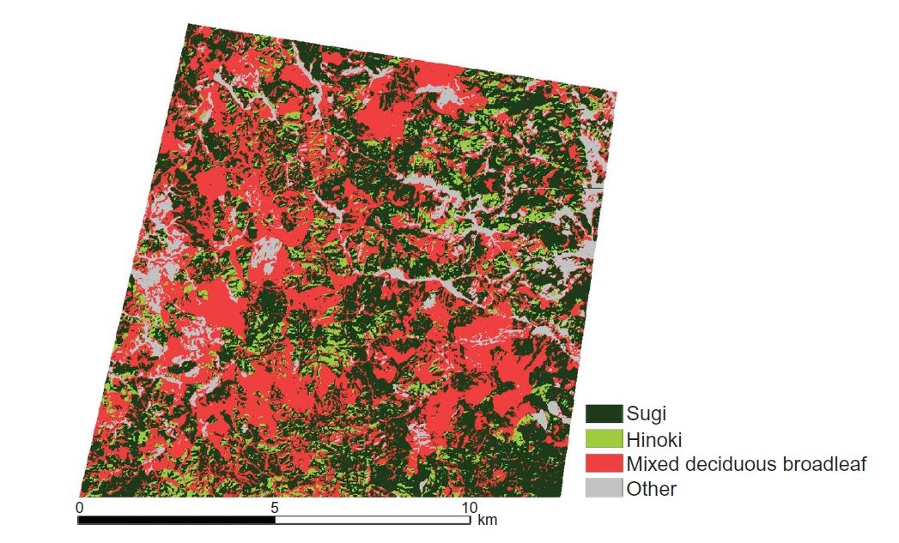

## Our project approach:
* Visualize the data with Seaborn
* Feature selection / dimension reduction
* LR, Perceptron, SVM Linear / RBF, KNN, Decision Tree, Random Forest  
* Neural network*
* Performance comparison

**Please open our forrest.IPYNB file and find out how we did everything!**

## Exploratory Data Analysis (EDA)
We used Seaborn to understand the distribution of the data and the relationship between features.
Since we are using more than 2 classes, we encoded the different tree types s, h, d, & o with 1, 2, 3, & 4.

## Principal Component Analysis (PCA)
* We split the data and implemented PCA from sklearn plot the test dataset to see if it can separate the classes well. (Inner Works on Code)
* The resulting plot indicates that the first principal component alone accounts for about 40% of variance.

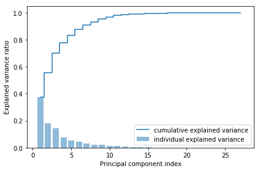

* After executing PCA, we can see in the resulting plot, the data is more spread along the x-axis,the first principal component,than the PC2, which is consistent with the explained variance ratio plot that we created above.

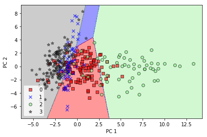

## LDA
* We plot the linear discriminants Using LDA from sklearn. (Inner Works on Code)

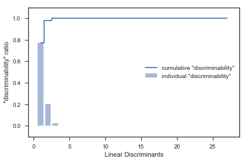

* As we can see from the figure, the first three linear discriminants alone capture 100% of useful information in the dataset.
* Using the transformation matrix, we transform the training dataset. 
**Now the four forests classes are perfectly linearly separable.

## Implementing 6 Different Methods:

* 1 LogisticRegression Model

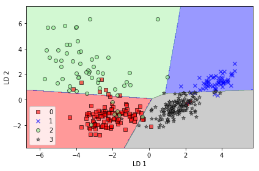

** Missclasified Samples: 51 | Accuracy: 0.675159

* 2 Perceptron

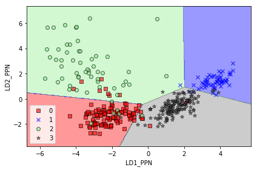

** Misclassified samples: 50 | Accuracy: 0.681529

* 3 SVM_linear

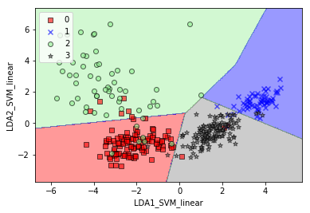
  
** Misclassified samples: 32 | Accuracy: 0.796178
  
* SVM_RBF

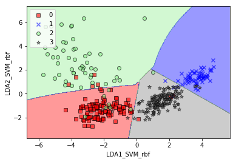

** Misclassified samples: 29 | Accuracy: 0.815287

* 4 KNN

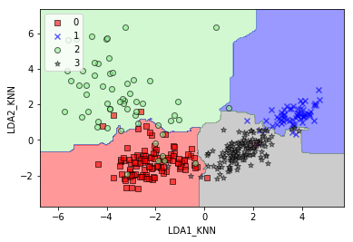

** Misclassified samples: 28 | Accuracy: 0.821656

* 5 Decision Tree

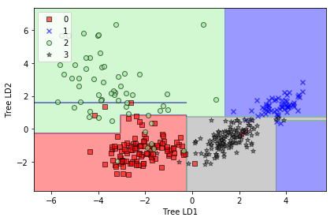

** Misclassified samples: 34 | Accuracy: 0.783439

* 6 Random Forrest

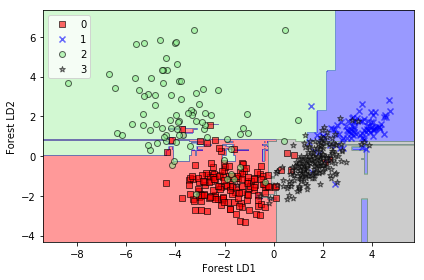

** Misclassified samples: 33 | Accuracy: 0.789809

### KNN (Accuracy= 0.821656, K=5)

## Reference
Original Paper: Johnson, B., Tateishi, R., and Xie, Z., 2012, Using geographically weighted variables for image classification, remote sensing letters,Vol.3 No. 6
